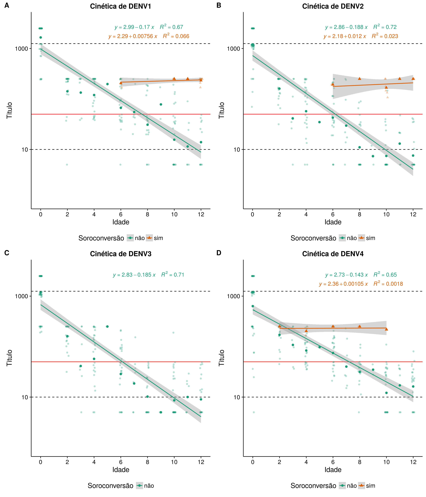

# Métodos

# Resultados

## Dengue

### Associação

### Cinética

#### Tempo de sororreversão

Tempo de sororreversão (título = 50)

- DENV1 ~ 7.6 meses
- DENV2 ~ 6.2 meses
- DENV3 ~ 6.1 meses
- DENV4 ~ 7.2 meses

Tempo de sororreversão (título = 10)

- DENV1 ~ 11.7 meses
- DENV2 ~ 9.9 meses
- DENV3 ~ 9.9 meses
- DENV4 ~ 12.1 meses

##### Tempo de corte de títulos 50 e 10

## Zika

