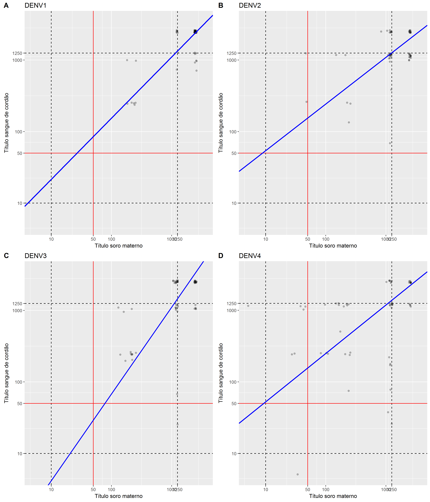
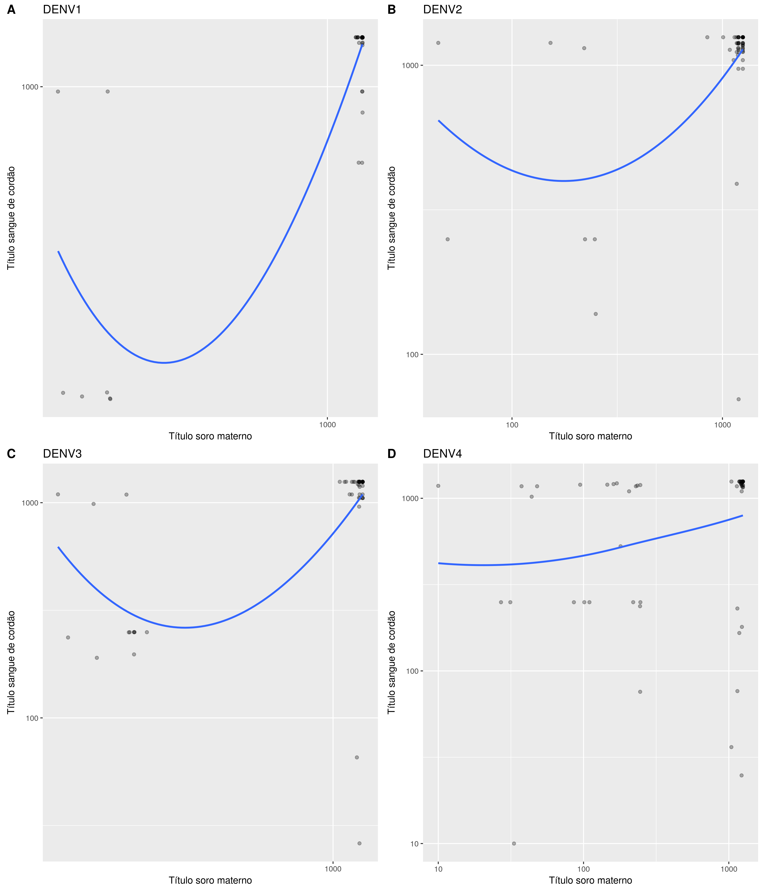

# Métodos

## Análise estatística

Todos os tratamentos e as análises dos dados foram realizados no software estatístico R, versão `r getRversion()` (https://www.R-project.org).
A regressão de Deming foi calculada com o pacote `MethComp` (versão `r packageVersion("MethComp")`).
Os intervalos de confiança exatos das proporções foram calculados usando-se o pacote `exactci` (versão `r packageVersion("exactci")`), contra a hipótese nula de que a proporção era igual a 50%.

Em todas as análises foi utilizado o nível de significância de 5%.

### Tratamento dos dados

Os títulos com valores abaixo da primeira diluição (<10) foram substituídos por 5.
Os títulos com valores acima da última diluição (>1250) foram substituídos por 2500.
Os títulos foram comparados usando o teste t de Student pareado, após transformação para escala logarítmica (base 10).

### Cinética de Dengue

A cinética de dengue foi estimada usando regressão linear simples entre os títulos de anticorpos neutralizantes e a idade dos bebês.
O tempo de sororreversão foi calculado como o ponto de interseção entre os valores de referência 50 e o limite de detecção da primeira diluição (título 10).

### Associação entre soro materno e sangue de cordão

A o grau e direção da associação entre dados numéricos foi analisada com o coeficiente de correlação de Pearson, após transformação pelo logaritmo.

A tendência de associação foi observada usando a regressão de Deming, que é capaz de avaliar simultaneamente as variabilidades experimentais de ambos os dados.

#### Taxa de transferência

A taxa de transferência foi definida como (TT) = (valor mensurado na amostra cordão/ valor mensurado na amostra materna)*100.
Para avaliar a TT média em cada sorotipo a média geométrica dos títulos foi utilizada. A TT média foi determinada como a razão entre as médias geométricas: (TTmédia) = (média geométrica na amostra cordão/valor mensurado na amostra materna).

# Resultados

## Dengue

### Associação

#### Correlação

Os valores de correlação de Pearson para as associações são:

- DENV1: r = 0.8308448, p = <0.001
- DENV2: r = 0.4262882, p = <0.001
- DENV3: r = 0.5217896, p = <0.001
- DENV4: r = 0.2314973, p = 0.0804

#### Regressão de Deming

<!--  -->

<!-- Obs: Escolher apenas um dos painés de figura acima! Não utilizar os dois! -->

#### Taxa de Transferência

|   &nbsp;    |  N  |  MG Sangue Cordão  |  MG Soro Materno  |  TT (%)  |  TT IC 95%  |
|:-----------:|:---:|:------------------:|:-----------------:|:--------:|:-----------:|
|  **DENV1**  | 58  |        1040        |       1010        |   103    |  [95, 112]  |
|  **DENV2**  | 58  |       981.8        |        926        |   106    |  [88, 128]  |
|  **DENV3**  | 58  |       823.6        |       830.9       |    99    |  [81, 122]  |
|  **DENV4**  | 58  |        640         |        452        |   142    |  [94, 213]  |

Table: **Tabela xx** MG = Média geométrica; TT = Taxa de transferência; IC = Intervalo de confiança de 95% em torno da média.

### Cinética

#### Decaimento dos títulos de anticorpos neutralizantes

#### Médias por idade

<!-- pander(cbind(BB1[, .(N = .N, Media.DENV1 = geomean(Titulo)), by = Idade][order(Idade)], -->
<!--              BB2[, .(Media.DENV2 = geomean(Titulo)), by = Idade][order(Idade)], -->
<!--              BB3[, .(Media.DENV3 = geomean(Titulo)), by = Idade][order(Idade)], -->
<!--              BB4[, .(Media.DENV4 = geomean(Titulo)), by = Idade][order(Idade)])[,c(1:3,5,7,9)]) -->

|  Idade  |  N  |  Media.DENV1  |  Media.DENV2  |  Media.DENV3  |  Media.DENV4  |
|:-------:|:---:|:-------------:|:-------------:|:-------------:|:-------------:|
|    0    | 58  |     1718      |     1262      |     1254      |     765.7     |
|    2    | 23  |     161.9     |      166      |      166      |      179      |
|    3    |  7  |     144.2     |     53.58     |     53.58     |     115.8     |
|    4    | 25  |     127.5     |     70.55     |     70.55     |     93.71     |
|    5    |  1  |     197.4     |     34.82     |      250      |     97.67     |
|    6    | 25  |     82.53     |     56.76     |     36.36     |     87.48     |
|    7    |  7  |     60.14     |     39.53     |     23.42     |     45.4      |
|    8    | 20  |     38.64     |     16.1      |     12.14     |     37.8      |
|    9    |  2  |     82.82     |     7.711     |       5       |     35.21     |
|   10    | 27  |     27.99     |     16.83     |     10.41     |     16.21     |
|   11    |  7  |     21.74     |     22.48     |     11.25     |     20.2      |
|   12    | 20  |     50.16     |     12.1      |     10.54     |     18.79     |

Table: **Tabela xx** Médias geométricas de títulos de anticopors neutralizantes, por idade (em meses).

#### Tempo de sororreversão

Tempo de sororreversão (título = 50)

- DENV1 ~ 7.6 meses
- DENV2 ~ 6.2 meses
- DENV3 ~ 6.1 meses
- DENV4 ~ 7.2 meses

Tempo de sororreversão (título = 10)

- DENV1 ~ 11.7 meses
- DENV2 ~ 9.9 meses
- DENV3 ~ 9.9 meses
- DENV4 ~ 12.1 meses

## Zika

--------------------------------------------------
 reg   Data_coleta_Rexames   PRNT 90   PRNT 50 D1 
----- --------------------- --------- ------------
 49        2016-01-11         708.3      116.67   

 49        2016-09-19         501.5      64.81    

 62        2016-01-18         160.3      52.05    

 91        2016-09-29         406.1      15.42    

 138       2016-02-04         430.3      116.67   

 177       2016-05-20         978.3      <1:10    

 197       2016-06-09         984.1      43.35    

 220       2015-06-25         262.9      83.33    

 239       2016-07-25         779.8      <1:10    

 280       2016-05-13         810.3      105.56   

 287       2016-06-09         530.1       36.7    

 329       2015-10-16         670.4       36.7    

 373       2016-05-20         436.8      21.35    

 376       2016-05-12         377.1      73.81    

 405       2016-06-28         182.8      <1:10    

 467       2016-07-04         586.9      <1:10    
--------------------------------------------------

Table: **Tabela xx:** Avaliação dos níveis de anticorpos neutralizantes para investigação da reação cruzada do PRNT anti-Zika e anti-Dengue em 20 crianças da coorte acompanhada neste estudo.
Avaliação contra DENV1, com razão >3.

--------------------------------------------------
 reg   Data_coleta_Rexames   PRNT 90   PRNT 50 D4 
----- --------------------- --------- ------------
 49        2016-01-11         708.3      <1:10    

 49        2016-09-19         501.5      <1:10    

 60        2016-01-07         274.8      <1:10    

 62        2016-01-18         160.3      <1:10    

 82        2016-05-12         633.3      <1:10    

 91        2016-09-29         406.1      <1:10    

 138       2016-02-04         430.3      <1:10    

 153       2016-09-23         157.1      <1:10    

 177       2016-05-20         978.3      <1:10    

 197       2016-06-09         984.1      245.33   

 220       2015-06-25         262.9      <1:10    

 239       2016-07-25         779.8      <1:10    

 262       2016-08-23         122.8      <1:10    

 280       2016-05-13         810.3      25.65    

 287       2016-06-09         530.1      <1:10    

 329       2015-10-16         670.4      17.67    

 373       2016-05-20         436.8      <1:10    

 376       2016-05-12         377.1      <1:10    

 376       2015-10-15         530.1      <1:10    

 405       2016-06-28         182.8      <1:10    

 467       2016-07-04         586.9      <1:10    

 541       2015-04-16         443.1      15.34    
--------------------------------------------------

Table: **Tabela xx:** Avaliação dos níveis de anticorpos neutralizantes para investigação da reação cruzada do PRNT anti-Zika e anti-Dengue em 20 crianças da coorte acompanhada neste estudo.
Avaliação contra DENV4, com razão >3.
