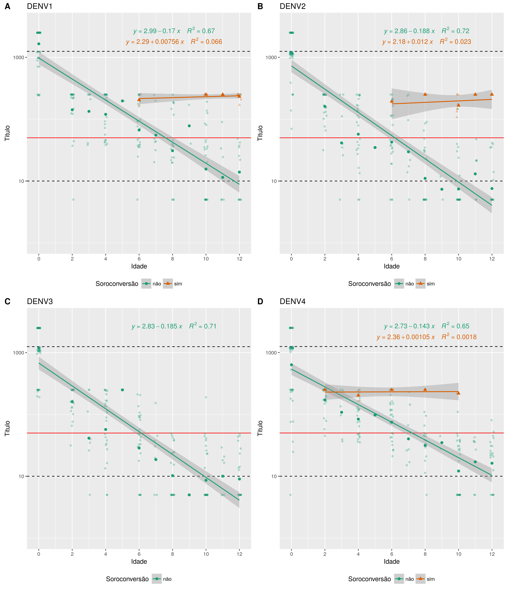

# Métodos

# Resultados

## Dengue

### Associação

### Cinética

#### Médias por idade

<!-- > pander(cbind(BB1[, .(Media.DENV1 = geomean(Titulo)), by = Idade][order(Idade)], -->
<!-- +       BB2[, .(Media.DENV2 = geomean(Titulo)), by = Idade][order(Idade)], -->
<!-- +       BB3[, .(Media.DENV3 = geomean(Titulo)), by = Idade][order(Idade)], -->
<!-- +       BB4[, .(Media.DENV4 = geomean(Titulo)), by = Idade][order(Idade)])[,c(1:2,4,6,8)]) -->

---------------------------------------------------------------
 Idade   Media.DENV1   Media.DENV2   Media.DENV3   Media.DENV4 
------- ------------- ------------- ------------- -------------
   0        1718          1262          1254          765.7    

   2        161.9          166           166           179     

   3        144.2         53.58         53.58         115.8    

   4        127.5         70.55         70.55         93.71    

   5        197.4         34.82          250          97.67    

   6        82.53         56.76         36.36         87.48    

   7        60.14         39.53         23.42         45.4     

   8        38.64         16.1          12.14         37.8     

   9        82.82         7.711           5           35.21    

  10        27.99         16.83         10.41         16.21    

  11        21.74         22.48         11.25         20.2     

  12        50.16         12.1          10.54         18.79    
---------------------------------------------------------------

Table: **Tabela xx** Médias geométricas de títulos de anticopors neutralizantes, por idade (em meses).

#### Tempo de sororreversão

Tempo de sororreversão (título = 50)

- DENV1 ~ 7.6 meses
- DENV2 ~ 6.2 meses
- DENV3 ~ 6.1 meses
- DENV4 ~ 7.2 meses

Tempo de sororreversão (título = 10)

- DENV1 ~ 11.7 meses
- DENV2 ~ 9.9 meses
- DENV3 ~ 9.9 meses
- DENV4 ~ 12.1 meses

##### Tempo de corte de títulos 50 e 10

## Zika

