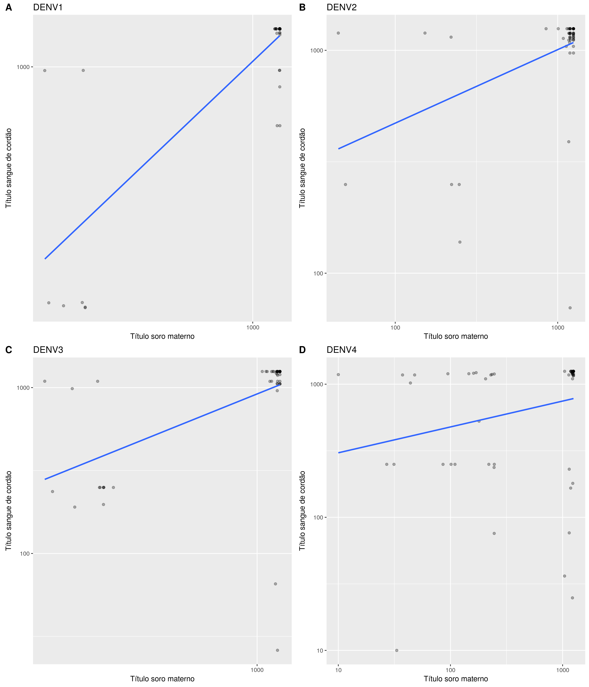
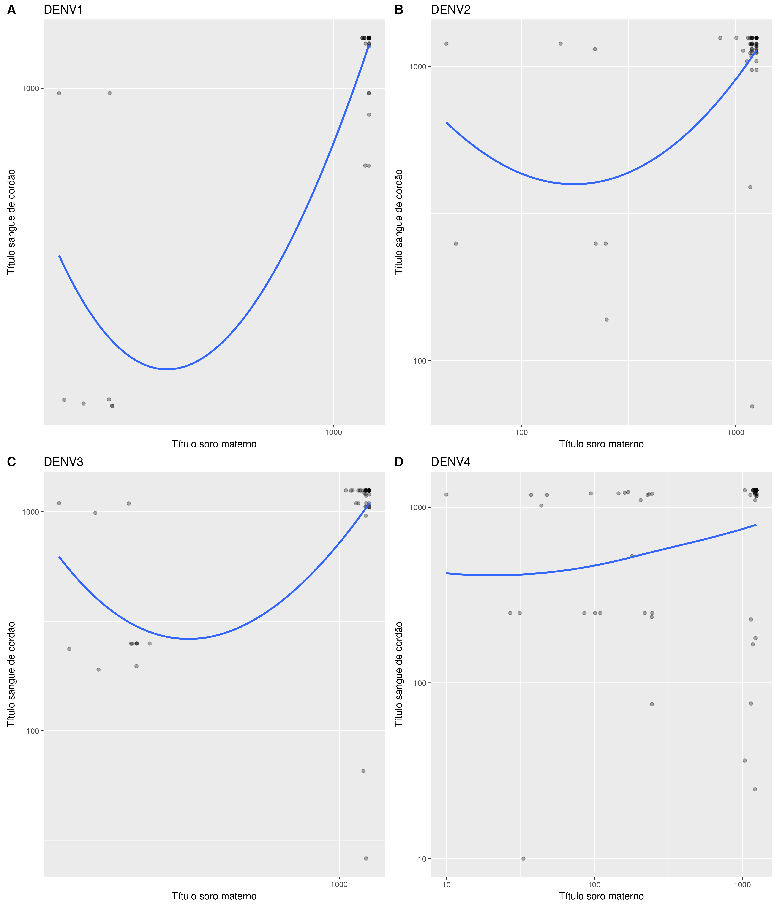

# Relatório
Felipe Figueiredo  
June 18, 2017  

# Métodos

# Resultados

## Dengue

### Associação

#### Correlação

Os valores de correlação de Pearson para as associações são:

- DENV1: r = 0.8308448, p = <0.001
- DENV2: r = 0.4262882, p = <0.001
- DENV3: r = 0.5217896, p = <0.001
- DENV4: r = 0.2314973, p = 0.0804

#### Regressão de Deming

<!--  -->

<!-- Obs: Escolher apenas um dos painés de figura acima! Não utilizar os dois! -->

#### Taxa de Transferência

|   &nbsp;    |  N  |  MG Sangue Cordão  |  MG Soro Materno  |  TT (%)  |  TT IC 95%  |
|:-----------:|:---:|:------------------:|:-----------------:|:--------:|:-----------:|
|  **DENV1**  | 58  |        1040        |       1010        |   103    |  [95, 112]  |
|  **DENV2**  | 58  |       981.8        |        926        |   106    |  [88, 128]  |
|  **DENV3**  | 58  |       823.6        |       830.9       |    99    |  [81, 122]  |
|  **DENV4**  | 58  |        640         |        452        |   142    |  [94, 213]  |

Table: **Tabela xx** MG = Média geométrica; TT = Taxa de transferência; IC = Intervalo de confiança de 95% em torno da média.

### Cinética

#### Decaimento dos títulos de anticorpos neutralizantes

#### Médias por idade

<!-- pander(cbind(BB1[, .(N = .N, Media.DENV1 = geomean(Titulo)), by = Idade][order(Idade)], -->
<!--              BB2[, .(Media.DENV2 = geomean(Titulo)), by = Idade][order(Idade)], -->
<!--              BB3[, .(Media.DENV3 = geomean(Titulo)), by = Idade][order(Idade)], -->
<!--              BB4[, .(Media.DENV4 = geomean(Titulo)), by = Idade][order(Idade)])[,c(1:3,5,7,9)]) -->

|  Idade  |  N  |  Media.DENV1  |  Media.DENV2  |  Media.DENV3  |  Media.DENV4  |
|:-------:|:---:|:-------------:|:-------------:|:-------------:|:-------------:|
|    0    | 58  |     1718      |     1262      |     1254      |     765.7     |
|    2    | 23  |     161.9     |      166      |      166      |      179      |
|    3    |  7  |     144.2     |     53.58     |     53.58     |     115.8     |
|    4    | 25  |     127.5     |     70.55     |     70.55     |     93.71     |
|    5    |  1  |     197.4     |     34.82     |      250      |     97.67     |
|    6    | 25  |     82.53     |     56.76     |     36.36     |     87.48     |
|    7    |  7  |     60.14     |     39.53     |     23.42     |     45.4      |
|    8    | 20  |     38.64     |     16.1      |     12.14     |     37.8      |
|    9    |  2  |     82.82     |     7.711     |       5       |     35.21     |
|   10    | 27  |     27.99     |     16.83     |     10.41     |     16.21     |
|   11    |  7  |     21.74     |     22.48     |     11.25     |     20.2      |
|   12    | 20  |     50.16     |     12.1      |     10.54     |     18.79     |

Table: **Tabela xx** Médias geométricas de títulos de anticopors neutralizantes, por idade (em meses).

#### Tempo de sororreversão

Tempo de sororreversão (título = 50)

- DENV1 ~ 7.6 meses
- DENV2 ~ 6.2 meses
- DENV3 ~ 6.1 meses
- DENV4 ~ 7.2 meses

Tempo de sororreversão (título = 10)

- DENV1 ~ 11.7 meses
- DENV2 ~ 9.9 meses
- DENV3 ~ 9.9 meses
- DENV4 ~ 12.1 meses

## Zika

